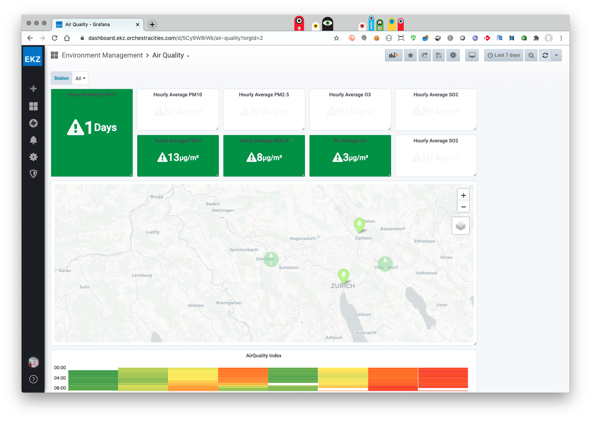
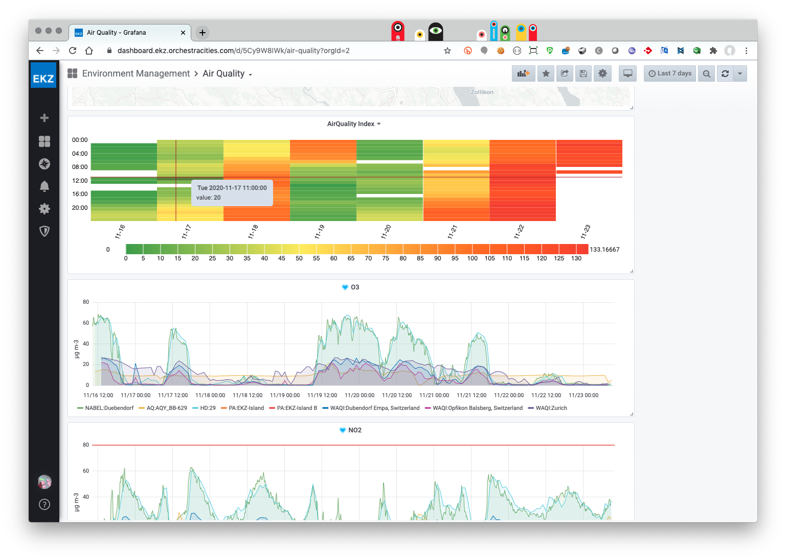

# dashboard

This is a playground to test [cube.js](https://cube.dev/)
as dashboard framework for Orchestra Cities

What's interesting?

- Cube.js offers a backend to query databases via APIs. The backend abstracts
  developers and users from SQL language via so called `cubes`
  query templates that can be then used by no sql experts to compose
  queries (like in [QlickView](https://www.qlik.com/us/products/qlikview)). 
  You can find more information [here](https://cube.dev/docs/cube).

- Cube.js support the automatic generation of `cubes` from database connections
  and `charts` from `cubes`. `charts` generation is automated for some of
  the most famous frameworks such as `rechart` and `chart.js`

- Cube.js allows to inject `context` into `cube` queries, making easier support
  for multi-tenancy and data level access control.

- Examples show also how by registering `cubes` it is then possible to allow
  dashboard creation / customisation by end users that are then archived
  in GraphQL db. It has to be coded (it's not a feature of the shelves),
  but it does not seem too complex. (While a `QueryBuilder` is available in the
  [code base](https://cube.dev/blog/react-query-builder-with-cubejs/)).

- `cubes` include *data navigation* primitives that allow to filter
   data across panels via [joins](https://cube.dev/docs/joins)
   and [segments](https://cube.dev/docs/segments)

Have a look at the [examples](https://cube.dev/docs/examples).

What could be a limitation?

- It's unclear how to expand data types (for example to support JSON or GeoJSON)

- Automatically generated `cube` schemas require some manual intervention
  to support more advanced queries. 

- There is no *meta query* concept, so you end up duplicating
  lot of queries if you want to expose the same data
  in different ways (e.g. average CO2 and max CO2 would require two 
  different `cubes`). What is possible though it to extend `cubes` via
  [extends](https://cube.dev/docs/cube#parameters-extends) parameter.
  

## Demo playground

This code base provide a small demo of using cube.js over TimeScaleDB with
some data stored by QuantumLeap API.

- Requirements: docker / docker-compose / node v10

To start the db:

```
$ sh start_db.sh
```

To populate the db:

```
$sh populate_db.sh
```

To run the cube.js backend:

```
$ npm install
$ npm run dev
```

You will find cube.js on http://localhost:4000

To run the demo app (in a different shell):

```
$ cd dashboard-app
$ npm install
$ npm run start
```

You will find app on http://localhost:3000

## Where to go from here?

1. Make a more complete dashboard for air quality with dynamic filtering
   of data (see filtering example here: https://github.com/cube-js/cube.js/tree/master/examples/material-ui-dashboard). It should be possible at least to
   filter by:
   * date
   * sensor id (entity_id)

1. Add a map to the dashboard. (see map example here: https://github.com/cube-js/cube.js/tree/master/examples/mapbox). (in this case only last data from a sensor should be visualised and when clicking on a sensor on the map,
 graphs should be update as in https://highcharts-demo.cube.dev/#/)

1. [Optional] Create your own dashboard (see example here: https://github.com/cube-js/cube.js/tree/master/guides/react-dashboard).

This is what a dashboard looks like today in OC:


